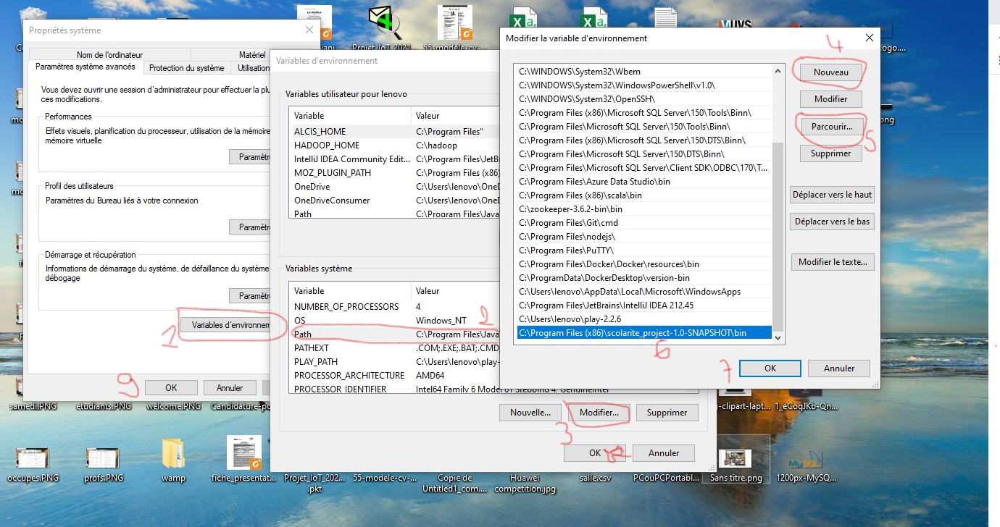
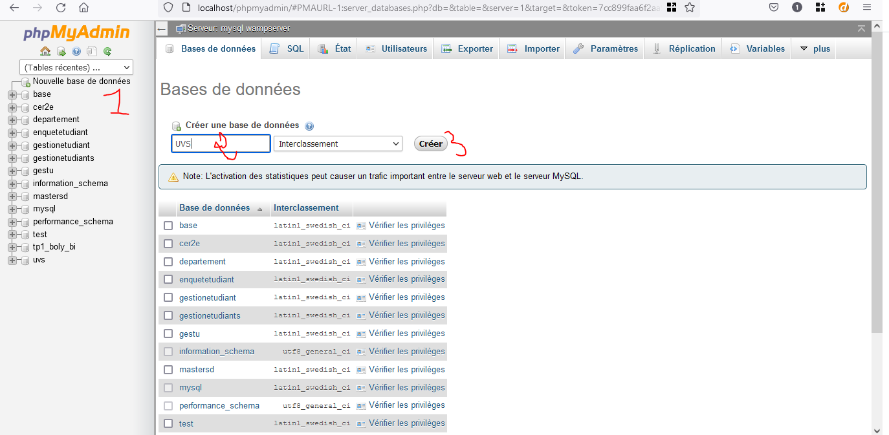
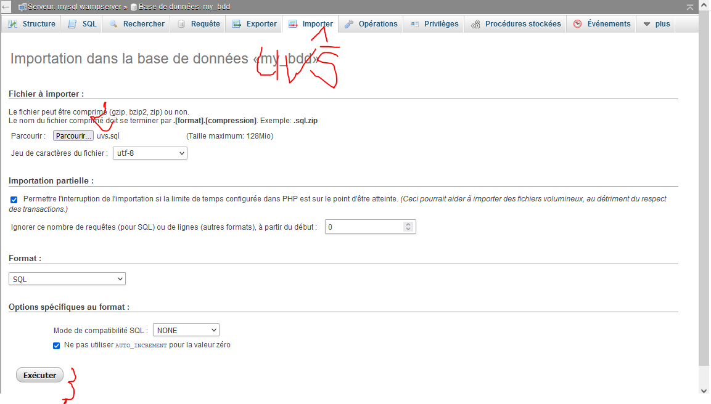
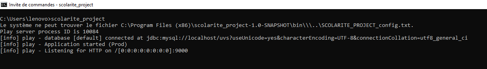
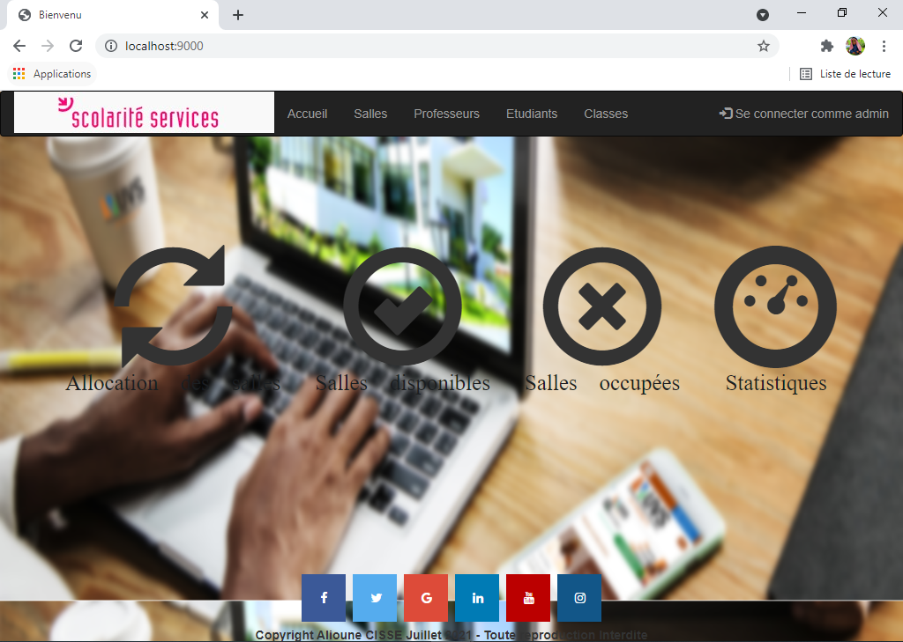

1. Télécharger le dossier complet dans votre environnement local

2. Définissez le chemin du dossier bin dans vos variables d'environnement si vous êtes sur windows
 

2. Pour les utilisateurs d'Unix, donnez les droits d'accès en tapant la commande : $ chmod +x /path/to/bin/scolarite_project
Noter que vous remplacerez path/to par le chemin qui mène à votre dossier bin.

3. Ensuite vous ouvrez votre wamp server (ou xamp si vous êtes sur lunix ou mamp sur mac) ou autre plateforme permettant de traiter du mysql; 
vous allez sur phpmyadmin et créer une nouvelle base de données que vous appellez "UVS"
Ensuite, cliquez sur la base de données nouvellement crée; allez sur l'onglet importer et choisissez le fichier UVS.sql qui 
se trouve dans le dossier que vous venez de télécharger
 
  

4. Enfin ouvrez votre terminal et tapez scolarite_project, vous aurez un message du genre :

 

5. Parfait, tout fonctionne maintenant; pour vérifier, allez dans votre navigateur préféré (google chrome par exemple) et tapez http://localhost:9000/

 
